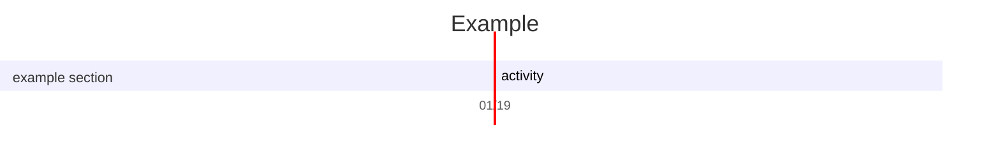
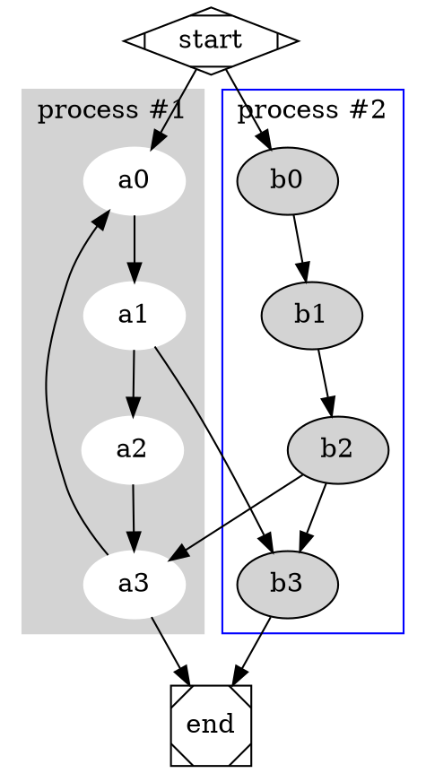

# ~/.config

These are some notes

```c
#include <stdio.h>

int main() {
    printf("hello, world!\n");
    return 0;
}

```

``` plantuml
Bob -> Alice : hello
```

${toc}
[[toc]]
[toc]
[[_toc_]]


$\sqrt{3x-1}+(1+x)^2$

$
\nabla \times \vec{\mathbf{B}} -\, \frac1c\, \frac{\partial\vec{\mathbf{E}}}{\partial t} 
$

$$
\begin{array}{c}
    \frac{4\pi}{c}\vec{\mathbf{j}} \nabla \cdot \vec{\mathbf{E}} & = 4 \pi \rho \\

    \times \vec{\mathbf{E}}\, +\, \frac1c\, \frac{\partial\vec{\mathbf{B}}}{\partial t} & = \vec{\mathbf{0}} \\

    \nabla \cdot \vec{\mathbf{B}} & = 0
\end{array}
$$





``` sequence-diagrams
Andrew->China: Says
Note right of China: China thinks\nabout it
China-->Andrew: How are you?
Andrew->>China: I am good thanks!
```

``` flowchart
st=>start: Start|past:>http://www.google.com[blank]
e=>end: End|future:>http://www.google.com
op1=>operation: My Operation|past
op2=>operation: Stuff|current
sub1=>subroutine: My Subroutine|invalid
cond=>condition: Yes
or No?|approved:>http://www.google.com
c2=>condition: Good idea|rejected
io=>inputoutput: catch something...|future

st->op1(right)->cond
cond(yes, right)->c2
cond(no)->sub1(left)->op1
c2(yes)->io->e
c2(no)->op2->e
```



